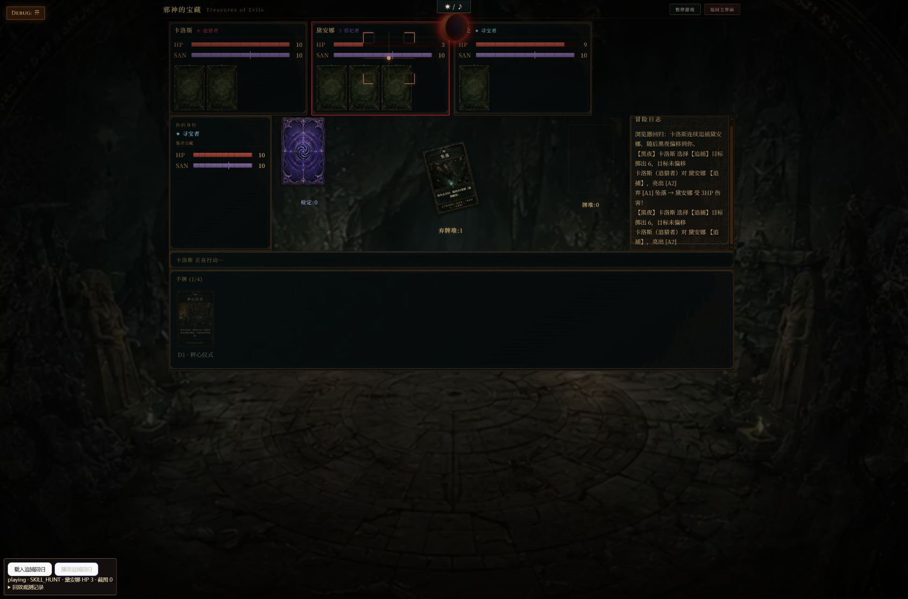
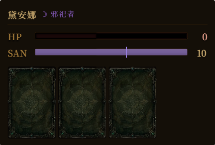

# 真实浏览器回归：连续追捕、黑夜和断头台

2026-09-13，使用 Codex 内置浏览器打开本地 Vite 应用，通过页面按钮和手牌点击操作。测试使用真实 `aiStep`、动画事务、React 面板、CSS 动画和 `html2canvas`；没有替换这些实现。固定输入用于稳定重现核心结算，不包含原始整回合中的摸牌、信仰及地磁场地动画。

## 重现入口

启动 `npm run dev -- --host 127.0.0.1`，打开 `http://127.0.0.1:5173/?regression=hunt-night`。

左下的「载入追捕回归」准备场景，「播放追捕回归」启动真实回放。该入口仅在本地 DEV 模式及指定 URL 参数下显示；正常游戏及生产构建不显示。预备状态停在本地行动阶段，实际规则输入仍是卡洛斯的 AI 回合。回放结束正常提交到玩家亮牌阶段。

「载入AI掉包回归」「播放AI掉包回归」重现黑夜偏移后的 AI→AI 暗中换牌。该场景在两次转移完成后停回本地行动阶段，便于重复检查。

## 实际观测

浏览器连续读取页面里的真实 HP 文本、血条样式、动画切片及图片加载状态，并保存截图。下面的数值来自 DOM，与开发面板记录互相核对。

| 检查点 | 结果 |
| --- | --- |
| 第一次瞄准黛安娜 | `HP6`，血条 `60%` |
| 第一段伤害 impact | 从 `HP6 / 60%` 变为 `HP3 / 30%` |
| 最后一次瞄准黛安娜 | 仍为 `HP3`，血条 `30%` |
| 最后一段伤害 impact | 从 `HP3 / 30%` 变为 `HP0 / 0%` |
| 断头台准备 | 先进入 `GUILLOTINE`，约 334 ms 后截图数由 0 变为 1 |
| 面板切割 | `slideUp`、`slideDown` 两个元素各加载一张完整的 432×292 PNG；观测到不同方向的旋转、位移矩阵 |
| 截图内容 | 实际 PNG 包含黛安娜姓名、身份、HP/SAN 条及三张卡背 |
| 黑夜偏移后的追捕 | 正确进入 `PLAYER_REVEAL_FOR_HUNT` |
| 真实点击 D1 秤心仪式 | 出现亮牌及「卡洛斯（追猎者）放弃追捕 你」日志，随后进入艾伦回合 |

完整逐阶段记录见 [browser-observations.json](browser-observations.json)。切割矩阵、图片加载状态和几何信息见 [guillotine-separated.json](guillotine-separated.json)。后续玩家操作记录见 [player-reveal-followup.json](player-reveal-followup.json)。

### 末次瞄准，HP 仍为 3

### 断头台实际使用的面板截图

切割属于不足一秒的瞬时效果，浏览器截图采集可能落在淡出阶段；[后段截帧](05-guillotine-separated.png)保留原始画面，配合 DOM 的旋转、位移和图片加载记录核对，没有延长或暂停生产动画来制作截图。

## 浏览器额外发现

页面曾报 AI→AI 掉包的视觉事件未完整覆盖。真实队列已包含黑夜骰、技能和两次转移；问题是 `hidePrivateCards` 隐私投影省略 `cards`，覆盖检查仍按可见卡面投影匹配。

修复增加 `hiddenCardIdentities` 供完整性检查核对，转移动画继续显示卡背。检查仍要求正确事件、双方角色、数量、卡实例和顺序；缺失或错误转移仍会失败。生产 `aiStep` 回归覆盖黑夜成功、失败偏移和序列化路径。

最终浏览器复测依次呈现 `DICE_ROLL → SAN_DAMAGE → SKILL_SWAP → CARD_TRANSFER(2→1) → CARD_TRANSFER(1→2)`，随后正常结束回放并恢复本地行动按钮。卡洛斯 SAN 为 9，两名 AI 均保留两张手牌。没有再出现视觉事件未覆盖异常。实际 `cardTransferFly` 元素分别具有约 −304 px、+304 px 的水平位移，动画期间出现非零变换与可见透明度。完整记录见 [swap-browser-observations.json](swap-browser-observations.json) 和 [swap-rendered-motion.json](swap-rendered-motion.json)；截图可能落在短暂移动效果的淡出时刻，以 DOM 运动记录核对实际转移。

复核还修正了隐藏身份数组与事务清单共享引用的问题：准备后原地篡改身份数组也会被拒绝，新增回归已经验证。

另有原先就存在的 React 样式诊断：战场根元素同时设置 `animation` 与 `animationPlayState`，在震屏切换时提示简写/长属性冲突。通过 blame 确认其来自旧提交 `f392e847`，本轮未扩展修改该样式。主场景没有截图失败或取消错误。

## 最终验证

- `npm run test:run -- --maxWorkers=4`：124 个测试文件、1598 项全部通过。
- 本次修改的 7 个 JS/JSX 文件 ESLint 通过。
- `npm run build` 及动画事务门禁通过；生产产物不包含本次 DEV 回归入口。构建仍提示已有的大文件体积提醒。
- `git diff --check` 通过。

Vitest 是脚本自动测试；上述浏览器回归由浏览器工具实际点击页面、读取渲染后的 DOM、截屏并检查控制台完成。它补充了真实渲染证据，目前没有接入 CI 成为每次提交自动运行的浏览器测试。开发入口及固定规则输入保留在仓库中，便于人工或浏览器工具重复执行。
