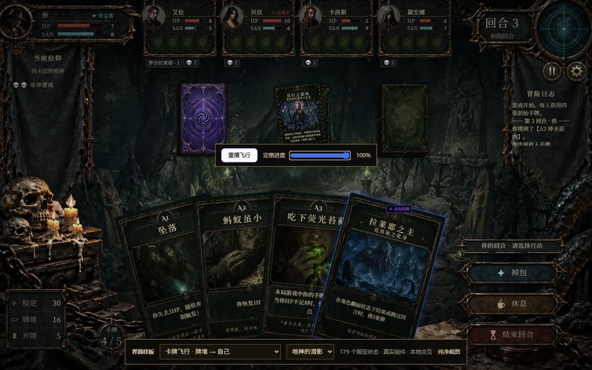
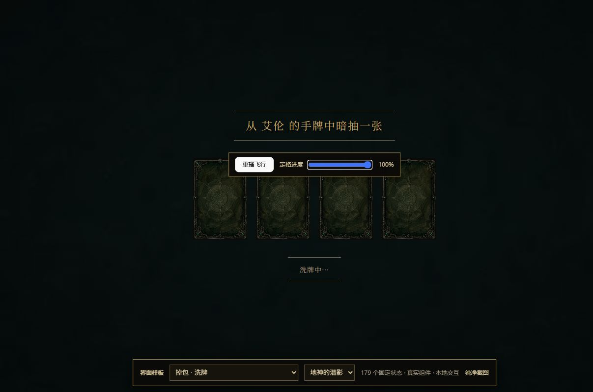

# 卡牌纵深与飞行定位（2026-09-15）

牌堆、手牌和飞行中的卡牌统一保持原始素材 392:590 比例。静态卡背使用 `background-size: contain`，动态帧使用 `object-fit: contain`，不再随容器拉伸。

## 画面与定位

- 保留玩家手牌的可读尺寸和与按钮、牌堆之间的留空；加大中景牌堆，其他角色手牌保持远景尺寸。旧布局在 113 px 棋盘行内的牌堆单牌由 36 px 增至 51 px，不增加行高。
- 飞行动画读取实际手牌卡面、牌堆顶牌、揭牌或选择弹窗的位置、尺寸和旋转角；起终点之间等比缩放。手牌扇形旋转后的包围盒不会被直接当作卡牌宽度。
- 覆盖通用转移、抽牌翻面、弃牌、活埋、洗回牌堆、地震、穴居对决、掉包暗抽、衔烛藏牌和藏宝图。抽到但尚未入手的区域牌/邪神牌弃置，从揭牌或选择界面出发；AI、多人回放和超时分支携带同样的来源元数据。
- 不改变规则结果、权威状态、HP/SAN 展示所有权或原有队列时长。

## 验证

- 149 个测试文件、1844 项测试通过；随后修改的洗牌展示与开发预览经过聚焦复查。ESLint、生产构建通过。
- 浏览器检查三种布局，覆盖 1280×720 和 1280×800。四种常见飞行方向的 14 个首尾帧记录在 `browser-checks.json`；测得位置和等比宽度误差均小于 0.02 px。
- 静态/动态卡背均核对 392:590；洗牌完成时四张牌为 110×165.55 px，落入实际 flex 槽位。
- 自动检查与画廊验证覆盖呈现和来源编译；未以真实多客户端对局逐一触发所有特殊牌组合。

开发画廊的 `flight-self-discard`、`flight-opponent-self`、`flight-self-opponent`、`flight-pile-self` 和 `swap-shuffle` 支持重播与进度定格，便于后续布局复核。

