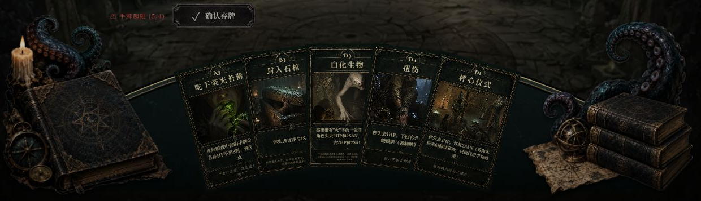

# 玩家手牌区重排 · 2026-09-14

以用户最新上传的 [效果图](user-reference.png) 为依据，替换旧按钮素材，完成实际组件拼接。

## 布局与规则

- 桌面手牌宽度按左右浮雕图像之间的实际净空计算：`卡宽 = 净空 / (1 + (牌数 - 1) × 0.8)`，测量时消除整张棋盘的 CSS zoom。相邻牌固定重叠 20%，卡面保持 392:590。当前 620px 净空下，四、五、六张牌分别约宽 182.35、147.62、124px；一两张牌最多宽 240px，避免极少手牌撑满整屏高度。
- 手牌与桌沿共用 `y=x²/(2R)`，卡牌上边缘沿曲线切线旋转。R 至少为 900，牌多时增大 R 控制弧顶高度，保持重叠比例不变。桌沿位于卡牌上边缘中点下方 10px，悬停或键盘聚焦的牌再向上抬升 22px 并置于前层。所有桌面手牌都沿弧线排列。
- 玩家手牌移除“编号 · 卡牌名”底部文字和悬停斜向大图，只保留卡面自身内容、选中提示与神牌行动提示。共享卡牌组件的这两项设置默认开启，其他区域沿用原预览。手机保留原有卡面尺寸和横向滚动、神牌点击提示。
- 置灰改用灰度和亮度滤镜，卡面透明度始终为 1，避免透出桌面或下层卡牌。[置灰状态截图](aligned-disabled.png)。
- 主操作靠手牌区左上方紧凑排列：技能、休息、繁衍、结束回合。繁衍仅在持有黑山羊幼仔时出现。手机四操作采用两列，手牌保持原尺寸、单行横向浏览；横屏操作组与手牌并排。
- 移除手牌区封闭矩形边框，用 SVG 裁切石面、描画弧形铜质桌沿。左右书卷、烛台与触手为独立透明浮雕，可伸出桌沿和手牌容器。装饰不接收鼠标事件，不放进移动端卡牌滚动层。
- 上半部分继续显示现有玩家、HP/SAN、牌堆和日志。桌面中央行按实际剩余高度回收留白，最低 113px，空间恢复时可以重新扩展。短桌面把“你的身份”与角色名并排并收紧留白；若仍不足以容纳放大的卡面，则使用页面纵向滚动，不改变卡面比例或重叠比例。保留原状态和数值显示。
- 没有引入参考图的费用数字、虚构卡面、敌方区、支援区或额外规则。技能限制、休息结算、结束回合条件和卡牌动画仍由原逻辑处理。

## 素材

使用内置 image_gen 制作素材。保留 [按钮母版](button-master.png)；[桌面母版](table-master.png) 仅截取中央裸石面，避免重复摆件。新增 [左侧浮雕母版](relief-left-master.png)、[右侧浮雕母版](relief-right-master.png)，按白色外底连通区域去底，保持物件比例，再导出透明 WebP。原始 [提示词](prompts.json) 和本次 [浮雕提示词](relief-prompts.json) 均保留。

运行时使用四张透明横向铜框：青绿技能、暖褐休息、暗紫繁衍、暗红结束回合，加一张石面和两张透明浮雕，共 296248 字节（约 289KiB）。文字、图标、选中和禁用反馈实时渲染。没有新增 React UI 框架或其他依赖。

旧八角符印的四张运行图片、切图脚本和本轮废弃母版已移除。新文件在 `public/img/ui/hand-table/`，切图记录见 [asset-slices.json](asset-slices.json)。可用 `python scripts/slice-hand-table.py` 从母版重新导出。

## 验证与预览

- 本轮 6 文件 207 项卡牌、图库、响应布局与教程定位测试通过。确认共享卡牌默认保留预览与标题，关闭手牌预览后不会生成大图，置灰卡保持不透明与原禁用行为。Lint 和生产构建通过，构建保留已有的大文件分包提示。
- 最新截图：[四张牌完整桌面](adaptive-desktop-900.png)、[五张牌完整桌面](adaptive-five-900.png)、[悬停抬升](adaptive-hover-hand-900.png)、[720p 滚动至手牌](adaptive-five-720.png)、[手机竖屏](adaptive-portrait.png)、[手机横屏](adaptive-landscape.png)。图库仍复用实际对局组件，五张牌截图来自引燃确认场景。
- 另从本地主界面进入实际单人对局，完成身份选择、摸牌收入手牌，再进入超限弃牌阶段。实际五张牌宽约 147.61px、无底部标题，行动阶段置灰透明度保持 1；选中弃牌后确认按钮由禁用变为“确认弃牌 (1)”，悬停只抬高手牌且渲染图像仍为五张。[实际行动阶段](adaptive-live-action-900.png)、[实际弃牌阶段](adaptive-live-discard-900.png)、[实际选中状态](adaptive-live-selected-900.png)。
- 1440×900 下四、五张手牌区底边分别约 891.5 / 890.2px，无页面溢出。五张牌在 1280×720 下页面高约 769px，可向下滚动 49px 查看完整卡面。390×844 手机竖屏无页面溢出，确认按钮实际点击高度 44px。悬停实测抬升由 −23.6463px 变为 −45.6463px，手牌区位置不跳动，未增加预览图像。
- 前版记录保留作历史对照：[720p](sculpted-desktop-720.png)、[900p](sculpted-desktop-900.png)、[手机](sculpted-portrait.png)、[小横屏](sculpted-landscape-small.png)、[五种视口几何](sculpted-geometry.json)。这些尺寸不代表本轮自适应放大后的布局。
- 六张桌面手牌中心与四个按钮的命中检查通过，浮雕均不接收点击。选中卡牌保留原 5px 抬升，定位属性与 refs 保留；手机手牌横向滚动可到达 [最后一张](sculpted-portrait-tail.png)，装饰位置保持不变。图库休息按钮的回调反馈已确认；固定场景用于视觉与交互入口检查，不替代真实对局规则测试。

开发服务使用 `?ui-gallery=1&scene=battle-status&clean=1` 查看四操作状态，`scene=battle` 查看普通手牌，`scene=discard` 查看选中效果。图库复用实际对局组件，固定数据仅用于布局验证。
