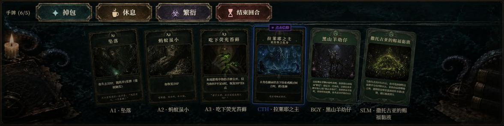

# 玩家手牌区重排 · 2026-09-14

以用户最新上传的 [效果图](user-reference.png) 为依据，替换旧按钮素材，完成实际组件拼接。

## 布局与规则

- 桌面真实手牌居中、轻微扇形展开，最多 ±6°；720p 卡宽 90px，较高窗口逐步增至 120px，卡面仍为 392:590。牌名与神牌提示保持水平。超过八张时平直换行。
- 主操作靠手牌区左上方紧凑排列：技能、休息、繁衍、结束回合。繁衍仅在持有黑山羊幼仔时出现。手机四操作采用两列，手牌保持原尺寸、单行横向浏览；横屏操作组与手牌并排。
- 桌面底图借用参考中的黑青石面、书卷、烛光与触手。上半部分继续显示现有玩家、HP/SAN、牌堆和日志，仅调整中央行高度，为完整手牌预留空间。
- 没有引入参考图的费用数字、虚构卡面、敌方区、支援区或额外规则。技能限制、休息结算、结束回合条件和卡牌动画仍由原逻辑处理。

## 素材

使用内置 image_gen 生成两张母版，按 [提示词](prompts.json) 制作：[按钮母版](button-master.png)、[桌面母版](table-master.png)。

运行时使用四张透明横向铜框：青绿技能、暖褐休息、暗紫繁衍、暗红结束回合，加一张桌面背景，共 135100 字节（约 132KiB）。文字、图标、选中和禁用反馈实时渲染；不为每个状态重复制作整张按钮。

旧八角符印的四张运行图片、切图脚本和本轮废弃母版已移除。新文件在 `public/img/ui/hand-table/`，切图记录见 [asset-slices.json](asset-slices.json)。可用 `python scripts/slice-hand-table.py` 从母版重新导出。

## 验证与预览

- 203 项相关 Vitest 测试通过，覆盖交互限制、图库渲染、响应布局、卡面及教程定位；全项目 Lint 和生产构建通过。
- [720p 桌面](desktop-720.png)、[900p 桌面](desktop-900.png)、[手机竖屏](portrait.png)、[横屏](landscape.png)、[小横屏](landscape-small.png)、[选中手牌](selected-cards.png)。
- [五种视口几何记录](geometry.json)：六张手牌与四个操作均可访问，无页面横向溢出；手牌区底边分别为 708.39 / 885.66 / 754.86 / 386.52 / 373.88px。
- 选中卡牌保留原 5px 抬升，定位属性与 refs 保留；手机手牌横向滚动可到达末尾。

开发服务使用 `?ui-gallery=1&scene=battle-status&clean=1` 查看四操作状态，`scene=battle` 查看普通手牌，`scene=discard` 查看选中效果。图库复用实际对局组件，固定数据仅用于布局验证。
