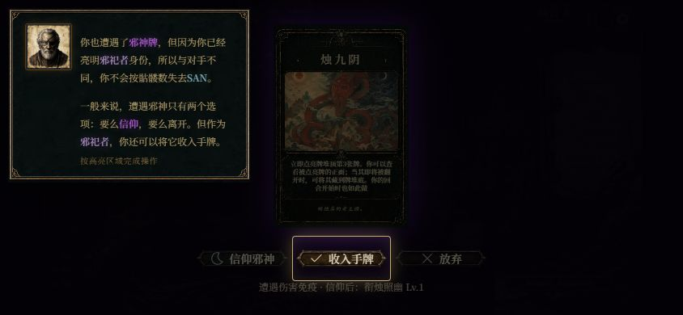

# 遗迹航路与新手引导收敛

当前唯一内置布局为「遗迹航路」（内部 ID `coastal`）。移除经典网格、弧形桌台及其专用资源；保留布局注册表、偏好存储、URL 预览、设置入口和 `BattleLayout` 替换接口。旧布局 ID 回退到当前布局。

扩展包主题保持独立。环境图、卡背及 `getBattleCamera(expansionKey)` 没有合并；地神步行运镜、群星行船推进、浪花和湿区仍随主题选择。

新手引导使用正式事件编译和严格动画队列。移除无限时长、组件 `onSettled` 暂停、手工拆分/恢复检定队列及旧数字步骤的动画抑制。教学在动作提交后继续说明；场景切换才恢复历史日志。提交沿用正式状态清理，避免旧摸牌快照覆盖新信仰和骷髅。

高亮按新侧栏、框上骷髅、神力标签和实际翻牌按钮测量。提示框测量真实高度，避开操作目标；手机横屏长说明可内部滚动。

实测发现并修复两处共享日志问题：求生骰子与收入日志缺失，追捕亮牌日志同时挂在目标/揭牌事件导致重复。现在各条日志由对应动画步骤揭示。

## 验收

- 1280×720 开始引导，走完寻宝者摸牌/骰子/掉包/藏宝图、追猎者两次攻击/死亡收牌、邪祀者区域牌赠送。
- 844×390 继续完成遭遇邪神、两次检定与改信、邪神收入和赠送、第二次神复活，进入正式对局身份选择。
- 改信后的旧快照问题已复现并修复，实际面板恢复显示不灭之躯及 2 枚骷髅；新增直接执行 App 提交函数的回归测试。
- 浏览器没有控制台错误；手机邪神决策截图见下方。
- Vitest：173 个文件、2165 项测试通过；ESLint、动画事务门禁、生产构建通过。构建仍提示既有大体积 bundle 警告。

