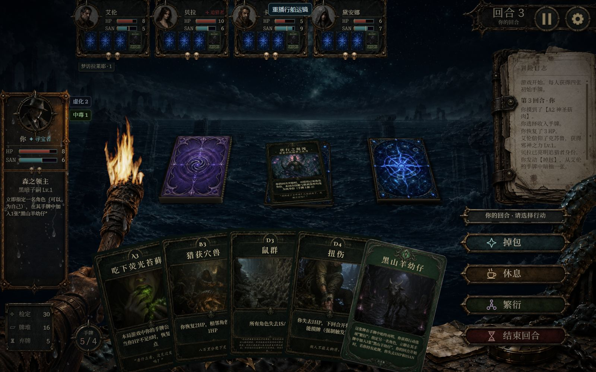
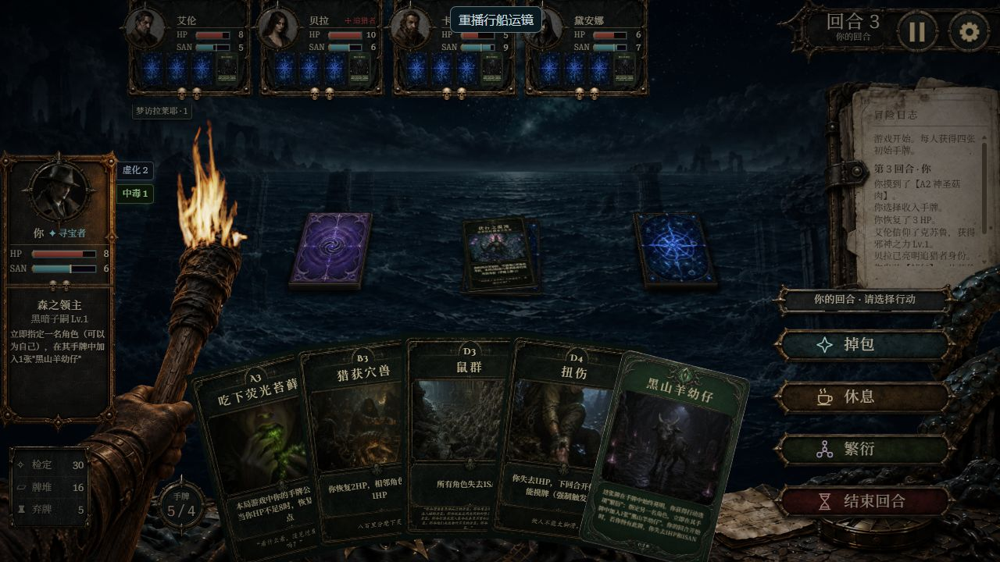
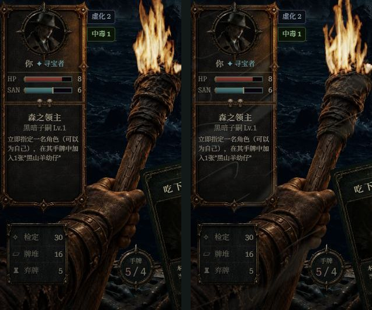

# 群星呼唤：行船探索

湿润材质当前已改为用户确认的干/湿底图混合，见[最终接入方案](../sailing-wet-lookdev-2026-09-18/README.md)。下文噪波水膜与可见度修订保留为早期试验记录，运行时不再使用其暗膜/反光贴图。

- 运镜：1→1.24，每段0.92秒，共3段。按海景1597×985素材的32%海天线及实际cover裁切计算消失点，放大期间海天线固定。
- 水花：前景背景接缝（约87%画面高）靠中轴起喷，左右按底图透明轮廓的不同曲线向外推进，水花自身向外、向下展开；每侧1张写实主浪与1小簇泡沫，火把局部另有3粒细飞沫。
- 湿润：玩家面板底板、火把木杆与持握手部共用同频时序，浪花到达后噪波水膜的暗湿区与方向性边缘反光增强，再渐干。水膜从右侧迎浪并向左下拖展，不再使用逐颗水珠贴图。停止探索时从当前真实opacity接2.2秒干燥，暂停不重启动画。
- 层级：主浪与前景同z=-1，DOM在前景之前，由前景、手牌和火把自然遮挡；少量泡沫独立z=16，只在手牌下缘窄带露出；火把细飞沫放在火把自身层叠容器，仍受手牌遮挡。全部在scene内、HDR火焰和overlay下方，pointer-events:none。文字不受湿润滤镜影响，卡牌比例不变。
- 资源预算：写实主浪WebP约148KiB、两张开源PNG约110KiB，湿润改用两张小型静态噪波WebP。无运行时生图、视频解码、逐帧噪波计算、全屏水面shader或永久RAF。手机实际帧率仍以具体设备为准。

## 素材

使用内置image_gen生成，原始RGBA保留，只做等比缩小和WebP编码：

- [写实浪花](../../public/img/effects/sailing/bow-splash.webp)：768×512。
- 旧[水珠与湿痕](../../public/img/effects/sailing/wet-droplets.webp)保留为设计归档，运行界面不再引用。
- [完整提示词和生成源文件记录](prompts.json)。

开源细飞沫来自[Kenney官方Particle Pack](https://kenney.nl/assets/particle-pack)，CC0，可商业使用。项目内保存[原许可证和来源哈希](../../public/img/effects/sailing/LICENSE-sources.md)，原PNG未编辑。

## 验收入口

开发页面：`?ui-gallery=1&scene=battle-coastal-sailing&ui-appearance=coastal&expansion=群星呼唤&clean=1`，点击“重播行船运镜”。使用正式BattleScreen、CoastalBattleLayout、camera与湿润组件；测试页按钮不进入正式游戏。

验收需覆盖正常推进/退出后干燥/暂停、16:10与19:10、窄横屏、非群星主题无浪花、全屏遮罩盖住飞沫与水膜、背景变换不扩大scrollHeight。

本次验收完成：

- 1600×1000：海天线原点320px；1900×1000：289.061px；844×390安全画布741×390：112.734px，均按cover裁切计算。
- 上述尺寸根节点scrollHeight等于clientHeight，页面无新增竖向滚动。
- 火把/面板湿润采样同步从0上升到约0.78，暂停前后保持0.77882；暂停时浪花CSS动画为paused，独立火焰也停帧。
- 探索退出后两层opacity均回0；地神主题浪花/湿润节点均为0。
- 222项聚焦测试、Lint、生产构建及动画事务门禁通过。完整采样见[runtime-checks.json](runtime-checks.json)。这是浏览器尺寸模拟，不代表手机硬件帧率实测。

## 浪花贴合与遮挡修订

前景素材1536×1024的alpha接缝用两条归一化曲线拟合：左支 `M(.50,.870) C(.40,.877,.25,.887,.10,.871)`，右支 `M(.50,.870) C(.61,.893,.73,.885,.85,.831)`；右端在触手向上升起前停止。路径和底图共用实际棋盘宽高，外部统一缩放，不随手牌数量改变接缝。主浪图像不做硬切，直接使用前景素材的原始alpha遮挡。

上层仅保留两簇44px泡沫，峰值opacity 0.38；火把前只允许3粒3～5px飞沫，峰值opacity 0.55，主要擦过下段握柄与手背。火焰始终高于水花。未添加素材、依赖或常驻RAF。

浏览器复核覆盖1280×720、1600×1000、844×390（实际安全画布741×390）；棋盘和前景宽高一致、路径同步缩放，页面scrollHeight没有增加。新增回归检查主浪DOM遮挡顺序、两个独立层叠容器、实际棋盘尺寸传递和归一化路径缩放。

## 材质水膜修订

`node scripts/generate-sailing-wet-film.mjs` 可复现384×512的暗湿场与反光场，两者来自同一周期噪波。左侧两种表面共用从右上至左下的方向，近似向量 `(-.88,.47)`：连片湿膜被斜向拉长，附带短分叉、尖尾；高光仅出现在朝光源的部分湿区边缘，不画完整轮廓或独立水滴。

运行时用整块表面的连续噪波mask覆盖面板的三个原始alpha切片，避免湿膜在顶盖/竖轨/底盖接缝处重新开始。下方、迎浪右侧权重更高。黑色alpha普通合成直接压暗底图并保留纹理，低强度冷灰至暖金反射模拟表面光泽；不使用会被父级opacity/mask隔离的内部multiply/screen混合。火焰和文字保持原样。

时序由另一层柔边遮罩控制：242°的湿润前沿从右上向左下掠过，噪波纹理本身固定在材质上。每次展开184ms，按60Hz约11帧；面板比火把延迟18.4ms，整个行船周期仍是920ms×3。中断探索时读取当前透明度与前沿位置，从已湿范围继续2.2秒干燥；暂停冻结同一个动画，减少动态效果时直接显示轻微静态水膜。

脚本检查无缝边界、同源高光、湿区覆盖率与无损alpha；最终两张纹理约41.7KiB。运行时只在小型材质层动画遮罩位置和透明度，无逐帧滤波或噪波生成。浏览器DOM采样的展开区间约205～213ms（含工具采样延迟），记录见[时序采样](wet-film-timing.json)。

## 水膜可见度修复

原反光纹理平均alpha仅0.0029，叠加位置遮罩和动画透明度后多数像素不足一个亮度级，边缘缩放后也不足一个屏幕像素。另查出开发模式注册了cache-first Service Worker，同名贴图重写后普通刷新仍可能显示旧图。

修复后反光平均alpha为0.0496、95分位0.2275，在同源湿区内增加连片反光，局部边缘宽约2.5纹理像素；暗膜峰值降至0.27，避免木杆、手套只变暗。位置权重下限从0.13提高到0.53。方向、184ms推进、渐干、火焰与遮罩层级均保持原方案。

水膜URL带固定内容哈希版本；重新生成后，将脚本输出的revision同步到`SailingWetSurface.jsx`。开发模式不再注册SW，仅注销本应用已有注册，不清除存档和缓存，不强制打断对局刷新；生产缓存策略维持原样。

开发对照页新增“干燥对照／水膜峰值”选项，固定材质便于比较，不影响正式游戏。1280×720和844×390已检查，窄横屏无新增滚动。下图左干燥、右固定水膜峰值；火焰为实时动画，形状差异不属于水膜改动。

