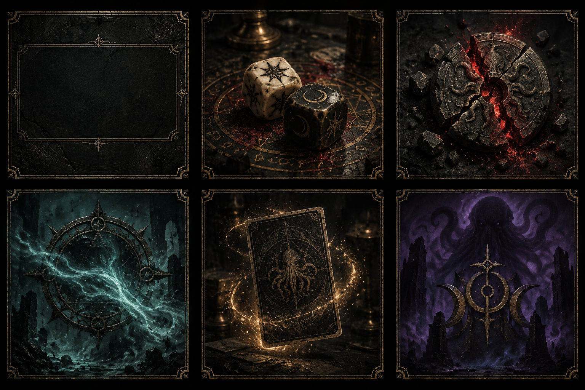

# 《邪神的宝藏》视觉效果自动化美化方案

日期：2026-09-12。依据：当前客户端 `8c4a297`、本地真实页面、现有素材与动画实现。

此文保留最初调研记录。后续已按用户完善要求完成全功能界面接入、167 个真实组件样板和可切图素材，见 [最新交付](../ui-redesign-2026-09-12/README.md)。以下阶段性状态不代表当前实施进度。

最初交付为规划、现状截图和一张 AI 风格样板。建议按“公共面板与高频反馈 → 技能与卡牌流转 → 区域与邪神演出”分批推进。以主界面的旧物材质和克制光效为标准，同时提高对局文字、目标和操作的可读性。

## 1. 当前基准与差距

主界面已经形成“深色遗迹原画 + 旧铜细边 + 磨损纹理 + 羊皮色衬线文字 + 少量阵营色”的稳定语言。它本身比较静态，因此其他画面的统一重点是材质、排版和反馈层次，不是增加持续闪动。

| 维度 | 当前依据 | 美化执行标准 |
| --- | --- | --- |
| 背景 | `StartScreen.jsx`：`#060707`，`bg_main.webp` 加暗角 | 保留背景纵深；对局信息区使用较平静的底材，不把主画直接铺进每个小面板 |
| 文字 | 标题 `#cbb293`；叙述 `#c5a983`；规则 `#d0b28a` | 标题、正文、辅助文字分层；提升当前战斗小字的清晰度，不能靠整体压暗来“统一” |
| 身份色 | 寻宝 `#8fd0ca`、追猎 `#d26458`、邪祀 `#a781cf` | 保留阵营识别；始终配徽章、标签或形状，避免只靠颜色表达 |
| 属性色 | 现有 HP 红、SAN 紫及回复色 | 保留既有语义；新纹理只改变质感，不把 SAN 条改成寻宝青绿 |
| 字体 | 中文 Noto Serif SC / 宋体；英文 Cinzel / IM Fell | 复用 `--font-serif-sc`；小字号正文优先可读，数值稳定对齐；验证字体回退 |
| 面板 | 低饱和铜边、内描边、细角饰，规则框圆角 8px | 统一边框厚度和留白；宽高变化用独立边角/遮罩，避免硬拉伸整张装饰图 |
| 光效 | 低亮暖金，阵营色局部强调 | 常态安静；动作前提示目标，命中时短促强调，尾段快速退场；不遮住数值和选择按钮 |
| 扩展主题 | 地神、群星已有完整色板和浮雕配置 | 两主题材质一致、色温不同。先贤/析骨当前仅有背景与牌背映射，先保留回退行为，不计作完整主题 |

主要差距：身份选择、联机大厅和多数决策弹窗仍是纯色矩形与彩色线框；高频公告、部分骰面和技能使用大字符图标、现代瞄准框或强渐变。战斗板、卡牌和区域特效已有不少成熟素材，应先复用。

本次实拍：1280×720 CSS 视口，DPR 1，body filter 为 none；主界面使用整页截图，其余为视口截图。Debug 标识可见，属于开发环境。这些截图是风格调查留证，不是已稳定化的自动回归基线；本次单机牌序未固定。

- [当前主界面](baseline-main.png)
- [当前身份选择](baseline-role-choice.png)
- [当前区域决策](baseline-zone-choice.png)
- [当前地神战斗](baseline-battle-earth.png)

尚未实拍本次方案的群星、联机房间和手机画面；这些部分的差距来自源码审计，实施前补齐基线。

## 2. 风格样板



从左到右、从上到下：通用面板底材、骰子材质、HP 命中裂纹、灵性雾、卡牌流转光尘、邪神显现。

这是一张概念图，不是可直接切入游戏的素材图集。正式骰子结果、文字、数字和几何仍由代码绘制；继续使用当前身份徽章、卡背和神明设定。青绿雾仅示意环境辅层，SAN 数值色仍保持紫色。样板较复杂的雕刻应在小尺寸运行时版本中减量。

已使用内置 image_gen，以实际主界面截图和现有绿色按钮为参考，一次生成。完整输入和提示词见 [imagegen-prompt.md](imagegen-prompt.md)。图片仅存于 docs，不进入资源清单或首屏下载。

## 3. 分批实施清单

| 批次 | 覆盖与具体改造 | 首个样板及验收出口 |
| --- | --- | --- |
| B0：冻结标准 | 在现有 `theme.js` / `GlobalStyles.js` 中补足共用表面、正文、边框、字体与交互态；整理现有资产；固定截图场景 | 地神/群星的面板与按钮各一套，主界面参考图、截图环境和动画诊断可复现 |
| B1：公共 UI | 身份选择、联机选项、大厅/房间、区域/拜神/弃牌等决策弹窗；复用徽章、铜边、线饰和深/亮按钮 | 先完成身份选择 + 区域决策两种样板，再批量迁移；长中文、选中、禁用、关闭、滚动无问题 |
| B2：高频战斗反馈 | 回合提示、骰子、HP/SAN 伤害/回复、通用死亡提示；统一战斗头栏、阶段条、操作按钮、日志字级 | 同一局面展示“掷骰 → 目标 → 命中 → 数值变化 → 退场”；保持现有时点，数值在峰值帧清楚可见 |
| B3：技能与卡牌流转 | 掉包的线框改为古物轮廓，狩猎改蚀刻式标记，蛊惑复用既有眼纹/符印；校准抽牌/飞牌/弃牌/洗牌的反光与落点尘屑 | 本机/远端目标和批量飞牌都指向正确位置；真实卡面与 392×590 逻辑框保持一致 |
| B4：区域与邪神 | 风、火、蛇、虫、地震、拉莱耶梦境、神力；沿用现有 Canvas、纹理扰动和部件，统一色温、尺度和遮挡 | 先选地神一个区域效果、群星一个梦境效果；正常/弱化动效均能辨认结算语义 |
| B5：结算与教学收口 | 胜利/复活标题、按钮与边饰；教程提示、软引导、信息弹层继承公共皮肤 | 最后动作全部播放后才进入结算；等待/确认/倒计时保留；教学高亮准确且可点击 |

B0 → B1 → B2 是推荐的首轮范围。B3、B4、B5 在共用皮肤稳定后可分组并行；由一个集成负责人维护公共样式与主题，避免多人同时改公共入口。每批单独提交，资产替换与消费代码一起回滚。

### 实施文件切口

| 工作面 | 优先文件 | 最小改法 |
| --- | --- | --- |
| 共用外观 | `src/constants/theme.js`、`src/components/GlobalStyles.js`、`public/fonts/fonts.css` | 复用已有变量与字体链；仅在重复处加入少量 class/样式常量，不建设新主题框架 |
| 公共面板 | `src/components/ui/ThemeMaskOrnament.jsx`、`src/components/theme/ThemeOrnaments.jsx` | 复用阴影/高光/纹线三层遮罩；几何角饰延续现有实现 |
| 弹窗/大厅 | `src/components/lobby/index.jsx`、`src/components/modals/index.jsx`、`src/components/start/StartScreen.jsx` 的联机弹层 | 先统一皮肤和按钮，不合并业务流程；尺寸可变的弹窗用边角分层 |
| 战斗常驻区 | `BattleHeader.jsx`、`SelfPlayerPanel.jsx`、`HandArea.jsx`、`BattlePhaseBar.jsx`、`BattleLogPanel.jsx` | 保持布局测量与点击锚点，统一字体、间距、可操作态和低权重辅助按钮 |
| 通用特效 | `src/components/anim/GenericAnimOverlay.jsx`、`DamageEffects.jsx`、`damageStyles.js`、`data.js` | 固定 SVG/CSS 骰面；伤害用局部裂纹/尘屑/雾边，不改结算事件 |
| 技能/转移 | `SkillOverlays.jsx`、`RandomTargetOverlay.jsx`、`CardFlipAnim.jsx`、`MoveOverlays.jsx`、`DeckReshuffleOverlay.jsx` | 只改变外观层；保留目标测量、卡面、回调与提交时点 |
| 大型效果 | `AreaCardOverlays.jsx`、`NightWindOverlay.jsx`、`SnakeTrapOverlay.jsx`、`BurrowingWormOverlay.jsx`、`CthRlyehDreamOverlay.jsx`、`WinAnims.jsx` | 复用当前绘制技术和资源，逐个效果校准；不换引擎 |

上表缩写文件在对应 `src/components/battle/`、`phase/`、`log/` 或 `anim/` 目录，完整目录以 `src/README_structure.md` 为准。不借此批次扩大 `App.jsx` 的规则职责。

## 4. 图像生成生产方案

先复用 `public/img/btn`、`logo`、`line`、`ui/theme_relief`、`effects` 的现有资产。首批运行时新图上限暂定 4 类；已有素材足够时该项直接跳过。

| 候选资产 | 建议规格 | 使用方式 |
| --- | --- | --- |
| 安静的旧石/旧铜底材 | 512×512，无文字，低对比 | 平铺或遮罩局部使用；必须检查拼接边，不因提示词写了 seamless 就直接通过 |
| 边缘雾 | 512 或 1024 方图，真实透明背景 | 命中、神力、弹层外围；优先尝试既有噪声扰动，仍缺质感才生成 |
| 稀疏尘屑 | 512 方图，真实透明背景 | HP 命中、洗牌落点共用；用 CSS/Canvas 控制运动 |
| 裂纹/侵蚀遮罩 | 512 或 1024 方图，无字、不含数值 | 伤害、石化等局部叠加；保留原面板和卡牌的可读区域 |

不逐张生成卡牌完整动画，不重新设计现有徽章/卡背，不把中文、骰点、HP/SAN 或可交互按钮烘焙进位图。需要循环运动时先移动/扰动一张稳定资产；仅确有必要才做帧序列，独立生成的帧不能假定天然连续。

每张图使用同一份参考包：主界面基线 + 对应主题真实背景/按钮 + 本效果现状。每次内置生成只处理一个独立素材，首轮 1 个候选；不合格时用一个明确差异继续修改，避免无目标地扩展变体数量。

单素材提示词模板：

```text
用途：邪神的宝藏游戏内 [具体效果] 的 [纹理/透明部件]。
参考：当前主界面控制材质与克制光效；当前扩展控制色温。
对象：[对象]。材质：旧铜、烟黑石材、磨损细纹；低饱和局部发光。
构图：[可读区/透明区/可拼接方向]；按最终显示尺寸设计细节密度。
输出：单个素材，[目标尺寸]；需要透明时要求真实 alpha。
约束：无字、无数字、无 UI、无水印，不增加新的阵营徽章或卡牌设计。
验收：边缘无白底或棋盘格，缩小后轮廓可辨，叠在两主题底色上无脏边。
```

原始图、提示词、参考路径和选优说明留在 docs 或非运行时源素材目录；选中版本转入 `public/img/ui/` 或 `public/img/effects/`。使用 `buildPublicUrl`；记录输出尺寸、字节数、alpha、哈希和消费组件。重用仓库已有转换/遮罩脚本，并先检查其输入输出契约；生成平台与压缩处理分开。素材不合格就保留已有外观。

当前预加载把效果图放入 deferred 阶段，但基础模式也会预取所有效果；新增 `/img/ui/` 图片则会进入首屏 bootstrap，不能按效果图的延后策略估算。首轮建议新增运行时图总量 ≤1.5 MiB，普通纹理 ≤256 KiB，新增首屏图合计 ≤256 KiB；这是待压缩实测的预算，不是已达到的结果。方案样板 PNG 不计入运行时预算。大图还须核算解码内存：1024 方图 RGBA 约 4 MiB，不能只看 WebP 文件大小。

## 5. 自动化闭环

目标是“可重复生成、可重复播放、可比较截图、可检查行为”。代码和素材检查可以自动判定；美感由基于参考图的视觉审查选优。单纯截图像素差无法判断是否更美。

1. **固定基线。** 记录提交、场景、主题、视口、DPR、字体状态、Gamma、资源状态。截取主界面参考与待改效果原图。不要将当前随机单机调查图直接当持续回归基线。
2. **建立最小场景集。** 复用现有 DEV `window.__toeDebug` 接口；目前多数功能仅有 JS 接口，缺少可见入口时补开发按钮。缺少的场景补固定牌、固定目标的局面入口；经正常规则与真实动画队列播放。禁止使用生产联机房间作为样式试验场。
3. **复用与生成。** 每批只处理表中一个样板；共用素材先过尺寸、透明边、缩放和双主题叠加检查，再接入消费组件。
4. **确定性采样。** 每个动态场景抓“进入、命中前、命中后、退出后”检查点；时间来自该步骤解析后的 `durationMs` / `impactAtMs`。无 impact 的公告采进入/中段/退出，不硬套伤害时点。
5. **控制视觉随机。** 仅给粒子/噪声传固定视觉 seed；不全局覆盖 `Math.random()`，不改变规则随机数。复用 `effectNoise.js` 的种子能力。队列使用 Date.now / 定时器，Canvas 使用 performance.now / RAF，骰子还涉及 interval / CSS；单独注入 Canvas elapsed 不会推进队列，暂停 CSS 也无法冻结 RAF。DEV 采样需协调共同起点、相关定时器与视觉 elapsed，在目标 cue 触发、React 提交及下一绘制帧后截图。该能力完成前只做时序留证和人工对照，不启用严格像素差阈值。
6. **自动检查 + 视觉选优。** 先检查文字、目标、遮挡、图像加载与动画诊断，再看并排图/叠加差异图，最后对比主界面材质。固定浏览器/字体环境才做像素阈值；随机或异步区域按场景解释差异，不用大面积遮罩掩盖效果缺陷。
7. **小批合并与留证。** 每批输出前后图、资源增量、相关测试结果和待解决项。相同标准通过后再迁移同类组件；资源清单由构建生成，禁止手填。

当前没有 Playwright 依赖、截图 npm 命令或完整视觉回归平台。第一轮使用现有浏览器工具和少量固定 DEV 场景即可。本方案不声称截图流水线已经实现。需要无人值守 CI 时，再添加一个小型截图脚本及必要开发依赖，复用这些场景；无须先引入 Storybook、通用截图平台、WebGL 或新动画库。

### 建议场景矩阵

| 场景组 | 必查场景 | 截图/行为检查 |
| --- | --- | --- |
| 公共 UI | 主界面、身份选择、区域选择、拜神、弃牌、联机空/多人房间 | 标题/正文/按钮层级、长中文、滚动、选中/禁用；确认和取消行为 |
| 基础反馈 | 自己/远端受伤与回复、SAN 变化、骰子结果、回合提示 | 命中前值不变，命中后只变一次；目标和骰点与事件一致 |
| 卡牌 | 抽牌、掉包、批量转移、弃牌、洗牌 | 牌面不串位、点击区域稳定；飞牌时手牌快照正确 |
| 连锁 | HP/SAN 连续变化、致命伤 → 不灭判定 → 死亡/继续、连续追捕 | 队列顺序、日志出现点、最终数值与最后结算时刻 |
| 场景特效 | 风/火/蛇/虫、地震、梦境、神力 | 常态/峰值/退场，局部遮挡，连续播放不残留 |
| 交互生命周期 | 暂停/恢复、离开对局、窗口缩放、弱化动效（待新增） | 没有漏发/重放/残留层，计时与点击可恢复 |
| 联机 | 主机/远端同事件、等待确认、最终结算 | 相同语义检查点结果一致；不要求网络到达时间完全相同 |
| 教学与结果 | 教学高亮、胜利、失败、复活确认/等待 | 指引位置准确；按钮和等待语义完整 |

视口先取：桌面 1440×900、低高桌面 1280×720、手机竖屏 390×844、手机横屏 844×390。B1 以公共 UI 覆盖四种视口；B2 起以“地神/群星 × 桌面/手机横屏”为核心组合，再对手机竖屏、多人同时命中和弱化动效做代表性抽查，避免无效的全组合截图。

## 6. 验收门槛与不可突破的边界

### 视觉与使用体验

- 在实际显示尺寸下检查，标题、正文、数值与按钮的可读性不能低于原版；铜饰不能进入文字区，纹理不能制造假按钮。新弹窗关键操作目标建议至少 44 CSS px；密集手牌仍沿用现有交互策略。
- 键盘焦点、选中、禁用、危险操作都有明确形状/文字差异；装饰层不接管交互，真正的模态遮罩仍按原规则阻挡背景。
- 两主题信息层级相同，局部效果语义相同；不把所有效果统一成金色。已有 HP 红、SAN 紫、身份色及火/风/梦境的差别要保留。
- 当前没有完整的全局弱化动效能力，首批可按 `prefers-reduced-motion` 降低新增装饰的震屏、循环辉光和粒子，仍保留目标标识、结果和数值更新。抽牌、骰子的 onSettled 由 JS 定时器驱动；不得缩短队列 cue、跳过 onSettled 或确认回调。只降低装饰表现，不全局清空所有动画。
- 新增微交互可采用约 160–250ms 的轻微淡入/位移；该建议只用于按钮/面板，不覆盖游戏演出时长。

### 动画与联机

- `gs.players` 是权威游戏值；可见 HP/SAN 由 `displayStats` 管理。美化不得把数值条直接接回最终权威快照。
- 规则产生 `_visualEvents`，组件只呈现；不从最终状态或日志重新推导效果。动画队列 commit 后才消费事件。
- HP/SAN 通用步骤在已有 impact 更新数值；黏液保留现有明示例外。断头、石化不自行修改属性条。
- 当前默认 HP 伤害/回复与 SAN 回复 impact 为 350ms，SAN 伤害为 460ms；步骤可以显式覆盖，以 `resolveAnimationStepTiming` 的最终结果为准。第一轮不改这些值、不改 `ANIM_SPEED_SCALE`、步骤间隔或抽牌总长。
- 飞牌提交仍使用 transfer-scoped 手部快照，不提前带入后续 SAN、死亡或手牌变化。日志仍在原开始/命中检查点出现。
- 保留各动画层定位与点击策略；`FullscreenLightLayer` 仅光层使用顶层 portal，不把全部 overlay 的 z-index 提到最大。
- 结算必须等最后相关动作完成；`WinAnims` 的确认、等待、倒计时和现有视频兜底保留。资源加载失败也不能卡住真实队列。

### 性能与资源

先用同设备、同场景采集当前帧耗时和资源基线，再比较改造结果。建议目标为桌面接近 60fps、手机至少稳定 30fps；场景 P95 帧耗时相对基线回退超过 10% 时检查粒子数、模糊/阴影与大图解码。上述目标尚未实测，不能标成通过。

避免全屏持续 blur/filter、多层无限粒子和每卡一段大视频。弱化档优先降粒子、动态采样与震动，不降低关键文字清晰度。验证连续播放与离开页面后的资源清理。运行时资源路径变化同步核对 `theme.js`、预加载和资源 manifest；当前卡背是独立 WebP 帧，不能只把文件改成图集。

### 工程检查

本次仅写方案与图片，未运行源码测试或构建。实施时按实际改动选择已有防线：

| 改动类型 | 检查 |
| --- | --- |
| 纯 CSS/素材/渲染皮肤 | 相关组件现有 focused Vitest（存在时）、浏览器场景、`npm run lint`、`npm run build` |
| 共享动画/HP/SAN/联机呈现 | 相关 focused 测试后 `npm run test:run` 完整测试、lint、build；重点检查 timing、statEvents、animationQueue、日志与 remote replay |
| 规则/AI 改动 | 不属于本轮美化；若以后单独涉及，额外运行 `npm run sim:headless` |
| 新增/替换 runtime 资源 | 构建刷新 `public/resource-manifest.json`，检查路径、体积与加载失败；仅 generatedAt 变动时清理噪声 |

重点现有测试：`animationTiming.test.js`、`animationStepSchema.test.js`、`statEvents.test.js`、`useAnimationQueue.test.js`、`useAnimationQueueLogs.test.js`、`multiplayerRemoteReplayExecutor.test.js`。`pretest:run` / `prebuild` 已执行动画事务守卫。不要为了纯皮肤新增一套重复业务测试。

## 7. 推荐的第一份实施任务

> 按本方案 B0–B1，先将“选择本局身份”和“区域探寻”弹窗统一到当前主界面的材质、徽章、文字与按钮标准。复用当前资产和 `--toe-*`，保持现有操作、数值、队列与联机语义。两种弹窗分别完成正常/选中/禁用/长中文状态，并在桌面、手机横竖屏截图核验。原素材不足时只补一张共用低对比底材，输出前后图、资源增量和相关检查结果，再迁移其余弹窗。

完成这一小批后继续 B2；每批的判断依据是已展示的真实组件和固定场景，而不是概念图完成度。

## 8. 源码依据

- 风格源头：[StartScreen.jsx](../../src/components/start/StartScreen.jsx)，身份色约 41 行，背景约 61–90 行，字体与标题约 118–129 行，面板约 179 行。
- 两主题、背景、卡背与资源映射：[theme.js](../../src/constants/theme.js)。
- 既有浮雕：[ThemeMaskOrnament.jsx](../../src/components/ui/ThemeMaskOrnament.jsx)、[ThemeOrnaments.jsx](../../src/components/theme/ThemeOrnaments.jsx)。
- 通用效果与骰面：[GenericAnimOverlay.jsx](../../src/components/anim/GenericAnimOverlay.jsx)、[data.js](../../src/components/anim/data.js)。
- 视觉噪声复用：[effectNoise.js](../../src/components/anim/effectNoise.js)。
- 数值/卡牌/日志边界：[README_structure.md](../../src/README_structure.md)，Visual Event Transaction Boundary 与 HP/SAN presentation boundary。
- 命中检查点：[animationTiming.js](../../src/game/animationTiming.js)；动画常量：[constants.js](../../src/components/anim/constants.js)。
- 延后预载：[useResourcePreload.js](../../src/hooks/useResourcePreload.js)，`selectDeferredResources`。
- 已有素材脚本：[scripts/README.md](../../scripts/README.md)。
- 调试触发器：[App.jsx](../../src/App.jsx)，DEV `window.__toeDebug`；实施时重新确认接口，避免依赖行号。

以上行号仅是本次审计定位，实际实施以前后代码和最新工作区规范为准。当前客户端子目录 `AGENTS.md` 在磁盘缺失，本次遵循工作区 AGENTS 指令与客户端 `CODEX_WORKFLOW.md`。
